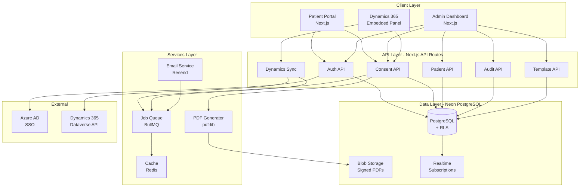
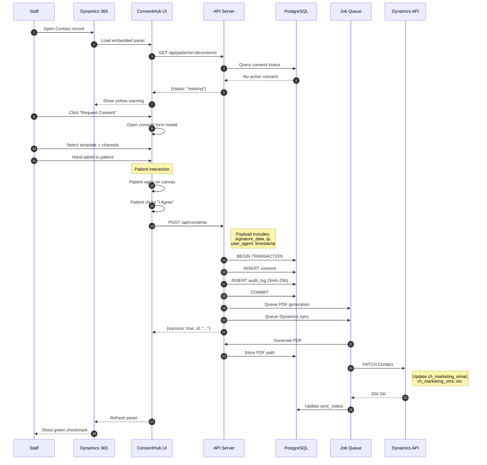
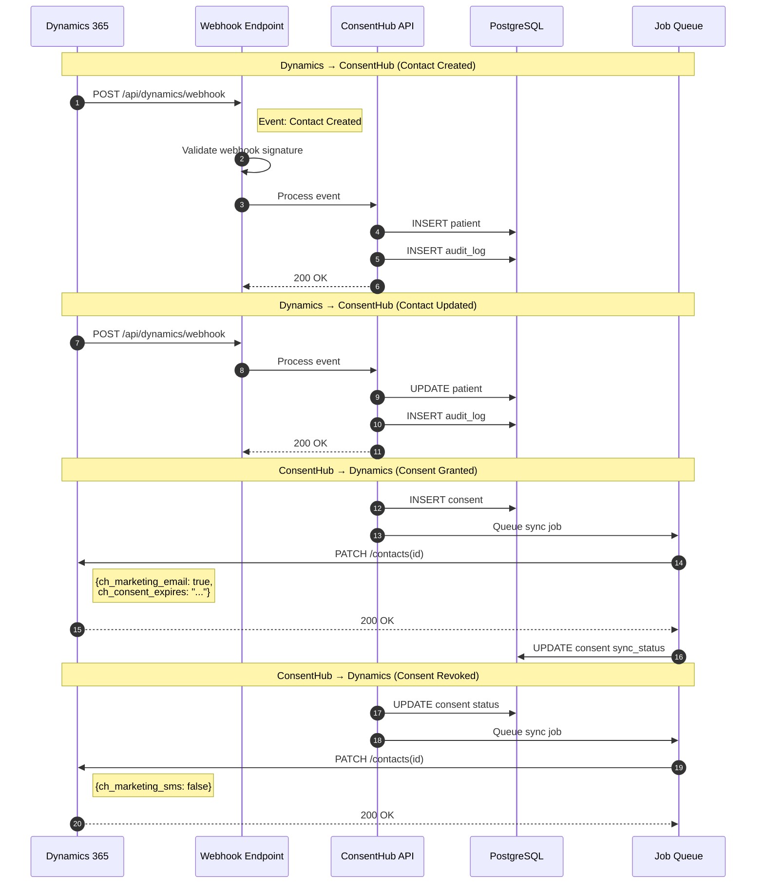
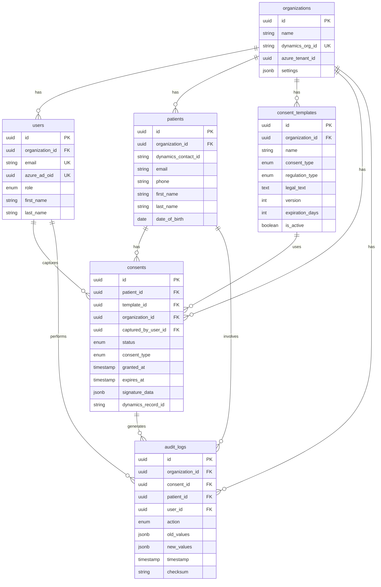
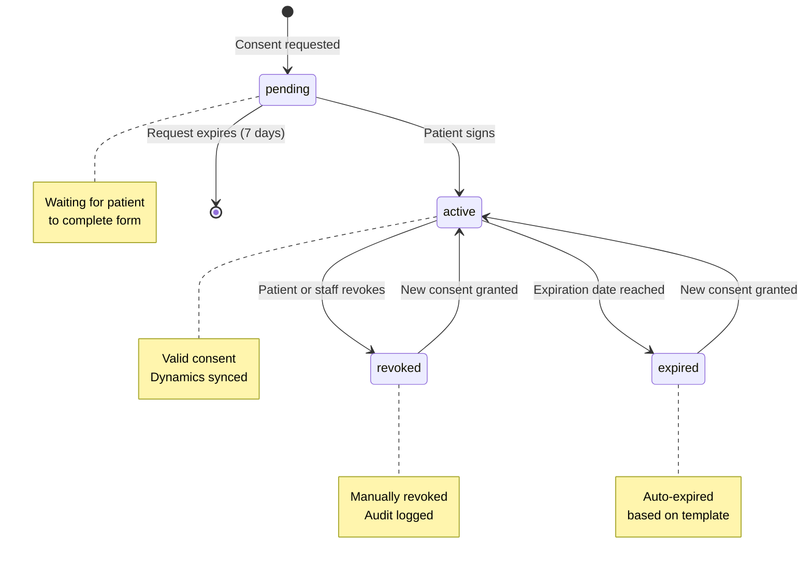
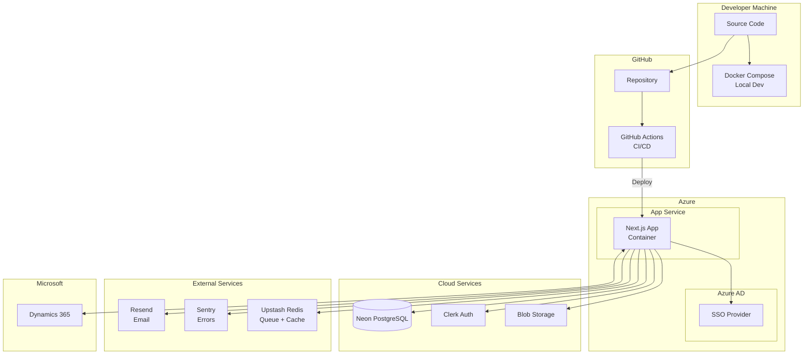
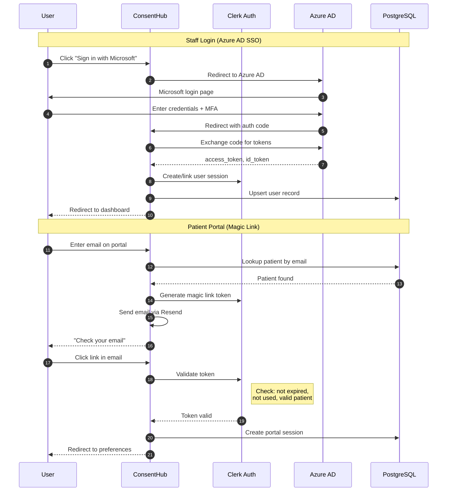

# ConsentHub Architecture Diagrams

All diagrams in Mermaid format. Render in any Mermaid-compatible viewer or in the demo site's architecture page.

---

## 1. System Architecture

---

## 2. Consent Capture Flow

---

## 3. Dynamics 365 Bi-Directional Sync

---

## 4. Entity Relationship Diagram

---

## 5. Consent Status State Machine

---

## 6. Deployment Architecture

---

## 7. Authentication Flows

